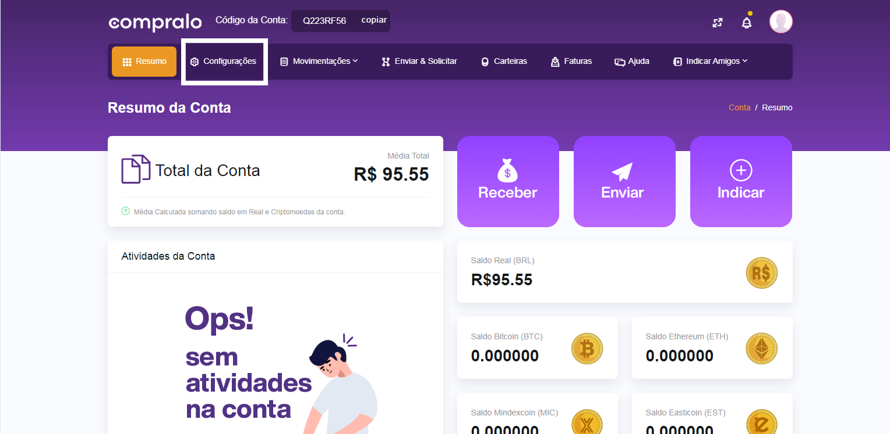
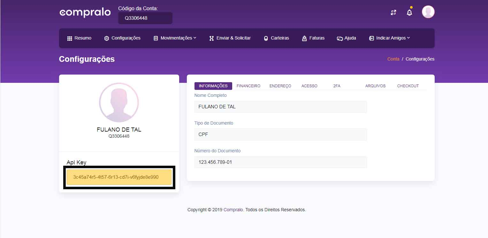

O plugin **WooCommerce Compralo** permite que lojistas aceitem pagamentos via criptomoedas usando a API Compralo. Ao finlizar uma compra os usuários são redirecionados para a plataforma da Compralo.

### Links

- [Cadastro Compralo](http://compralo.io/empresa/)
- [Obtendo Credenciais](#obtendo-credenciais)
- [Processo de compra](#processo-de-compra)
- [Perguntas Frequentes](#perguntas-frequentes)
 
### Instalação

1. Acesse o painel de administrador do WordPress.
2. Na barra lateral direita, vá para: Plugins > Adicionar novo.
3. No campo de buscas entre com "WooCommerce Compralo". 
4. Selecione nosso plugin na lista e clique em "Instalar agora".
5. Por fim, clique no botão "Ativar" após a instalação.

### Requisitos

- Uma conta Compralo
- Credenciais de acesso para API. (As credenciais são obtidas no dashboard Compralo)
- Certificado SSL. (É recomendado que sua loja possua um Certificado SSL)
- Plugin "WooCommerce" ativado e instalado.
- Versão mínima do PHP  5.6
- Versão mínima do WordPress  4.8

### Ativando forma de pagamento

1. Acesse o painel de administrador do WordPress.
2. Na barra lateral direita, vá para: WooCommerce > Configurações.
3. Na nova página aberta localize e selecione a aba "Pagamentos".
4. Marque o boão corresponente ao "Compralo Redirect" para selecioná-lo como ativo no checkout.
5. Click em "Gerenciar" para abrir a tela principal de configurações.

### Configuração

Na tela de configurções do plugin insira as demais informações:

- **Enable / Disable**  - Ativar para usar. Desativar para desligar.
- **Checkout Title**  - Escolha o título exibido aos clientes durante o checkout.
- **Checkout Description**  - Adicionar informações mostradas aos clientes no checkout.
- **Sandbox Environment** - Marque para ativar o ambiente de testes.
- **API KEY** - Chave Secreta para Autenticação na API Compralo.
- **Sandbox API KEY** - Chave Secreta para Autenticação na API Compralo no ambiente de testes.
- **Enable Log** - Quando estiver marcado ativa o registro de log para o plugin.

------------

# Obtendo credenciais

Obtenha a chave de acesso para a comunicação entre a API Compralo e o plugin **WooCommerce Compralo**. A chave de acesso identifica você como titular de uma conta, são fornecidas de maneira a autorizar o uso de funcionalidades específicas de uma API junto a sua integração.

### Acesso a conta

Isso se aplica caso você ainda não possua as credenciais de API da Compralo. Você precisa de uma conta do [Compralo](http://compralo.io/empresa) para continuar.

### Procedimentos

1. Entre na sua conta da Compralo em: [https://app.compralo.io/](https://app.compralo.io/).
2. Localize e clique no menu "Configurações" e aguarde a nova tela aberta.

<figure class="thumbnails">
    
</figure>

3. Na nova tela, localize e copie as informação do campo **Api Key**.

<figure class="thumbnails">
    
</figure>

4. Use a API key para [configurar](README?id=configuração) as opões do plugin.

------------

# Processo de compra

O processo de compra descreve as etapas necessárias para o registro e finaliação de uma venda utilizando o plugin **WooCommerce Compralo**.

### Fluxo do checkout

Os clientes deixam o seu site a partir da página do finaliação de compra para realizar a transação na plataforma Compralo. O usuário poderá realizar o pagamento via Transferência Bancária ou em criptomoedas como Bitcoin, Ethereum, Mindexcoin e Easticoin.

### Cenário típico

- O cliente entra na loja.
- O cliente adiciona produtos ao carrinho.
- O cliente fecha a compra e vai para o checkout.
- Na página de checkout, o cliente preenche seus dados (Não é necessidade informações de endereço).
- Após, o cliente seleciona a forma de pagamento "Compralo Redirect" e solicita o pedido.
- O cliente é redirecionado para a plataforma Compralo onde deve escolher uma forma de pagamento.
- O cliente deve entrar com sua conta ou realizar o seu cadastro.
- O cliente efetua o pagamento da cobrança.
- O cliente sai da plataforma Compralo e é redirecionado para a página de obrigado dentro da loja.
- O pagamento é processado e confirmado pela Compralo.
- Uma notificação de API é enviada para o loja e tratada pelo plugin "WooCommerce Compralo".
- O plugin "WooCommerce Compralo" altera o status da ordem com base no novo status de pagamento recebido.
- Um e-mail é enviado para o usuário contendo a relação da compra.
- Um e-mail de confirmação é enviado para o lojista.

------------

# Perguntas Frequentes

Confira o nosso banco de perguntas e respostas mais frequentes. Caso não encontre a solução para o seu problema, abra um chamado e envie sua pergunta para nosso time de especialistas.

### Dúvidas de Negócio

#### 1. O que é Compralo?

Somos o primeiro sistema de pagamento com Criptomoedas do Brasil. Através de um sistema integrado que permite pessoa física ou jurídica, aproveitar as vantagens e facilidades das Criptomoedas no Brasil e no mundo. Se você tem um estabelecimento poderá contar com a Compralo e receber seus pagamentos em Criptomoedas. 
Além disso, a Compralo implementou uma inovação, agora você pode contar com uma Wallet (carteira virtual) dentro da nossa plataforma.

#### 2. Quais os benefícios da Compralo?

Pagamentos imediatos, tanto quanto menor ou maior valor, tem a mesma agilidade, facilidade e taxas exclusivas. Você recebe suas vendas diretamente na sua conta (Wallet), sempre sujeito a aprovação e segurança do sistema Blockchain.

A tecnologia Blockchain é segura, não permitindo fraudes ou possíveis erros uma vez que você não se preocupa com:

 
Cartão de crédito: infelizmente tentativas de fraude via cartão de crédito são muito frequentes. Só no Brasil foram registrados em 2017 cerca de 1,96 milhões de tentativas de fraudes.

Dinheiro falso: mais de 340 mil notas foram identificadas e recolhidas no Brasil como ilegítimas até setembro deste ano (dados do Departamento do Meio Circulante do Banco Central do Brasil).

 
Máquina de cartão adulterada: prejudicando tanto os comerciantes quanto os clientes, essas máquinas não se comunicam com os servidores dos bancos centrais, apenas gravam as informações do cartão e senha não havendo nenhum protocolo de segurança. Além de obter uma plataforma integrada e segura você gera mais interação com seus clientes aceitando pagamentos em mais de um lugar utilizando o mesmo sistema.

 
Agilidade, segurança, privacidade e o mais importante, você no controle de tudo. Você pode receber em Reais (BRL) ou em Criptomoedas, dentre elas trabalhamos com Bitcoin (BTC), Ethereum (ETH), Easticoin (EST) e Mindex Coin (MIC). 
Você pode transferir para sua conta bancária ou para sua Wallet Compralo.

#### 3. Por que devo oferecer o serviço da Compralo aos meus clientes?

A tecnologia está em constante evolução e isso nos exige adaptação. Hoje mais de 15 mil estabelecimentos já aderiram ao sistema de pagamentos com Criptomoedas no mundo segundo o [coinmap.org](https://coinmap.org/#/world/54.47003761/20.12695313/2).

#### 4. Sou lojista, como obtenho as vantagens da Compralo?

Acesse o site da Compralo e Cadastre-se. Após a aprovação de seu cadastro, você receberá todo o material de apoio que preparamos para você e já poderá receber pagamentos de forma simples e segura através do sistema QR Code.

#### 5. Não sou lojista. De que forma posso trabalhar com a Compralo?

Preparamos uma forma para você, que não possui loja virtual ou física, mas entende que representamos a revolução do mercado financeiro e da economia digital. Cadastre-se no site Compralo.

#### 6. Como faço para realizar um saque em BRL?

- Na sua conta, clique em Carteira na barra superior da página.
- Selecione Real (BRL).
- Selecione o botão Retirar.
- Preencha seus dados do banco, caso não esteja preenchido e o valor que deseja sacar. 
- Clique em Solicitar Saque. Em 48 horas úteis o dinheiro estará na sua conta.
	  
#### 7. Como realizar um saque em CRIPTOMOEDA?

- Na sua conta, clique em Carteira na barra superior da página.
- Selecione a Criptomoeda que deseja sacar.
- Selecione o botão Retirar.
- Informe o valor que deseja sacar e a Wallet de destino.
- Valide sua solicitação com o 2FA.
- E Confirme a transação.
- Clique em Realizar transação.

#### 8. Quais tarifas estarei sujeito a pagar?

##### Depósito: 

Em BRL o valor cai na conta no prazo de 24 horas úteis com uma taxa de 2,5%.

Pessoa Física: Depósito em BTC com taxa zero.

Pessoa Jurídica: Depósito em BTC com taxa 2,5%.

##### Saque: 

Pessoa Física: Saque em BRL R$ 9,50 fixo e Saque em BTC taxa de 1%.

Pessoa Jurídica: Saque em BRL taxa de 2,5% + R$9,50 fixo e Saque em BTC taxa de 2,5%.

##### Transferências: 

Da Compralo para uma exchange/wallet: taxa de 2,5%.

##### Transações compra e venda entre clientes Compralo: 

Pessoa Física:  Recebimento imediato e taxa zero. Limite de R$5.000,00 diário (Valores acima de R$ 5.000,00 ficarão pendentes, sujeitos a análise).

Pessoa Jurídica: Recebimento imediato e envio de valores ilimitado com uma taxa de 2,5%.

# Suporte e ajuda

Para outras dúvidas acesse nosso [FAQ](https://compralo.freshdesk.com/support/home) completo ou envie sua dúvida para nosso [suporte](https://compralo.freshdesk.com/support/tickets/new).